# 🌱 2025년 새싹 해커톤(SeSAC Hackathon) 🌱

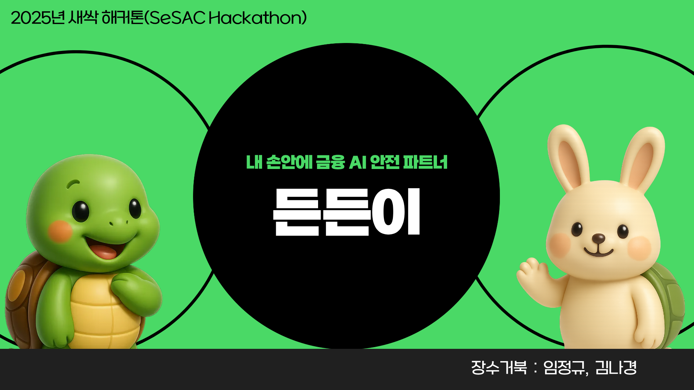

## 💡 제안 배경
노년층 대상 금융 교육 움직임은 증가하고 있으나, 노년층 금융 범죄 피해 건수도 나날이 증가하고 있다.   이를 해결하기 위해 <b>기존 교육 방식에서 변화</b>가 필요하다.
 

### 🔍 노년층 대상 금융교육 증가

  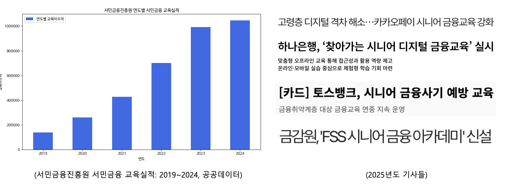 

서민금융진흥원의 노년층을 포함한 금융 취약계층 대상의 금융 교육은 이수자 100만 명을 넘어가며 증가하고 있고, 공공기관뿐만 아니라 금융권에서도 노년층을 대상으로 한 교육을 확대하고 있다. 
이러한 교육의 확대에도 불구하고 노년층을 대상으로 한 금융 범죄의 피해 건수는 이전에 비해 증가하고 있다.

### 🔍 노년층의 금융사기 피해 증가

  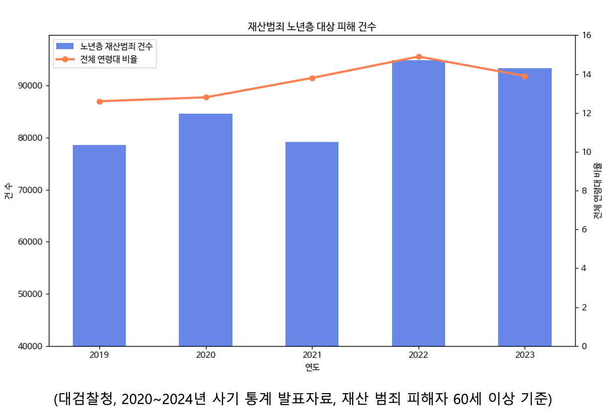 

대검찰청 자료에 의하면 60세 이상 노년층을 타겟으로 한 재산범죄 건수가 8만대에서 9만대로 증가했고, 전체 연령 대비 노년층의 피해자 비율 또한 증가했다. 
특히 노년층을 대상으로 하는 금융 범죄는 보이스 피싱, 스미싱, 카톡에 집중되어 있다. 
이러한 형태의 금융 범죄가 노년층에게 큰 피해를 주는 이유는 다음과 같다.

### 🔍 높은 자산 대비 낮은 금융 이해력

  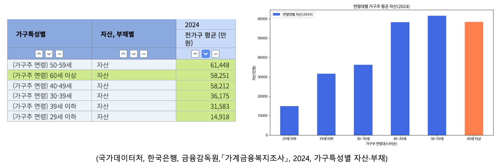 

2024년 기준 국가데이터처가 수집한 가구 특성별 자산 현황에 따르면 60대 이상 가구의 자산 규모는 평균 5억 8천만원대로 전 연령대 중 두 번째로 높다.

  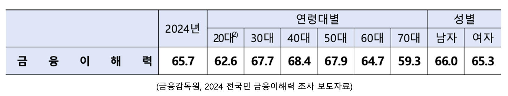 

반면에 2024년 금융감독원이 실시한 전 국민 금융 이해도 조사 결과에 따르면 60대 이상의 금융 이해도는 다른 연령대에 비해 낮은 편이다. 많은 자산을 가지고 있지만 금융 이해도와 금융 범죄 인지가 낮다는 점을 노려 금융 범죄의 표적이 되고 있다.

### ❗️ 기존 금융 교육의 한계
기존 금융 교육의 가장 큰 한계는 사용자의 실제 금융 생활과 교육이 분리되어 있다는 점이다. 자산관리와 사기 예방은 실제 생활에선 동시에 이뤄지는 자연스러운 연속선에 있음에도, 대부분의 교육 서비스는 이를 각각 따로 제공하고 있어 사용자는 배운 내용을 실제 상황에 적용하기 어렵다. 
또한 기존 교육은 "공부를 위한 공부" 형태로 제공되어 몰입도가 낮고, 반복적으로 사용되기 어려워 지속적인 예방 효과도 떨어진다. 즉, 실제 금융 상황에서는 교육에서 배운 대응 패턴이 즉시 떠오르지 않는 구조적 한계가 존재한다.

 

## ⭐️⭐️ “AI 맞춤형 금융 안전 서비스”인 “든든이”로 해결!!! ⭐️⭐️
#### ✅ 자산 정보에 맞춰 실제와 유사한 시뮬레이션을 통해 금융 범죄 대응 능력을 강화
#### ✅ 자산관리와 금융 범죄 예방을 “하나의 서비스 흐름”으로 통합
#### ✅ 학습 상황과 실제 금융 범죄 상황의 괴리를 해소

 

## 📚 활용 데이터 및 AI 모델
### 📊 데이터
| 데이터기준 | 데이터명 | 분야 | 출처 |
|-------------|-------------|-------|-------|
| 공공 금융 지식 데이터 | 한국은행 경제/금융 용어사전 | 금융 | 한국은행 |
|  | 금융감독원 금융상품 API | 금융 | 금융감독원 |
|  | 국민연금·퇴직연금 제도 설명 자료 | 금융 | 국민연금 |
| 금융 범죄 시나리오 생성 데이터 | 경찰청 피싱/사기 범죄 유형 통계 | 금융 | 경찰청 |
|  | 금융감독원 금융 사기 보도자료 | 금융 | 금융감독원 |
| 노년층 금융 이용 행태 데이터 | 국가데이터처 고령층 금융·자산 현황 | 금융 | 국가데이터처 |

생성형 AI와 공공 금융 지식 데이터와 노년층 금융 이용 행태 데이터를 통해 노년층의 자산관리를 도울 수 있는 전략을 제공하고, 금융 범죄 시나리오 생성 데이터를 통해 노년층 자산 상황에 맞춰 자산관리 과정 중에 자연스럽게 금융 범죄 시뮬레이션을 제공한다.

### 🤖 AI 모델
| 모델 | 모델명 |
|-------------|-------------|
| OpenAI API  | GPT-4o |

OpenAI API와 RAG 기술을 활용하여 자산관리 전략을 제공하고, 금융 범죄 시뮬레이션 또한 제공한다.

 

## 🎯 아이디어 개요

#### ✅ 가지고 있는 자산을 기반으로 전반적인 자산관리 전략을 제공한다.
#### ✅ 자산관리 전략을 제공하는 과정에서 자연스럽게 금융 범죄 시뮬레이션이 진행된다.
#### ✅ 노년층은 생성된 시뮬레이션을 통해 자산 맞춤형 금융 범죄 패턴을 사전에 접할 수 있다.
#### ✅ 노년층은 리포트를 통해 금융 범죄 패턴에 대해 보완해야 하는 점을 알 수 있다.

이를 통해 60세 이상 노년층의 자산관리를 도우며 당할 수 있는 금융 범죄를 예방한다.

 

## 🛠️ 적용기술

SpringBoot를 기준으로 전체적인 서비스를 제공한다. MySQL에 자산 지키기 서비스를 통해 얻은 사용자 자산 정보를 저장하여 맞춤형 자산 전략과 금융 범죄 패턴 제공 시 참조한다. 금융 범죄 패턴과 Open AI API를 결합한 RAG를 통해 금융 범죄 시나리오를 생성한다. 이는 Airflow를 통해 주기적으로 진행하여 최신 패턴에 대한 시나리오를 업데이트한다. 사용자는 LangChain을 통해 구현된 AI 챗봇을 통해 시뮬레이션 서비스를 제공받는다. 이후 결과를 분석하고 MySQL에 저장된 주의 사항과 용어를 참조하여 리포트를 생성하여 사용자에게 제공한다.

 

## 🪧 서비스 방법

로그인 이후에 사용자의 자산 정보 및 생활 정보를 입력한다. 입력받는 자산을 기준으로 AI 자산 진단 결과를 제공하고 본격적인 자산 관리 계획을 생성한다. 
이 과정에서 자연스럽게 사용자의 자산 및 생활 기반의 금융 범죄 시나리오를 발생시킨다. 문자메시지 피싱, 보이스 피싱과 같은 상황을 제공하고 사용자의 대응 행동을 기록한다.   상황이 종료된 후 사용자의 대응에 따른 결과를 저장한다.  
각 상황에 대한 사용자의 대응을 종합하여 대응 점수와 위험 요인을 설명하며 추가적인 예방 교육을 진행한다. 이 모든 시뮬레이션 결과는 사용자는 결과 보고서 확인 기능을 통해 접근할 수 있다.

 

## 🖥️ 주요기능 & 서비스 UX/UI
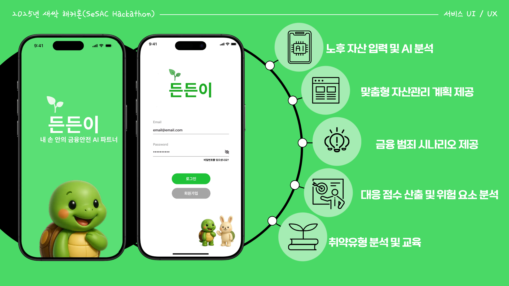
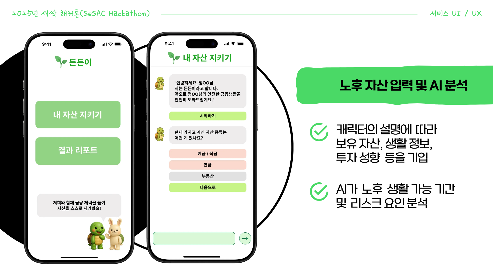
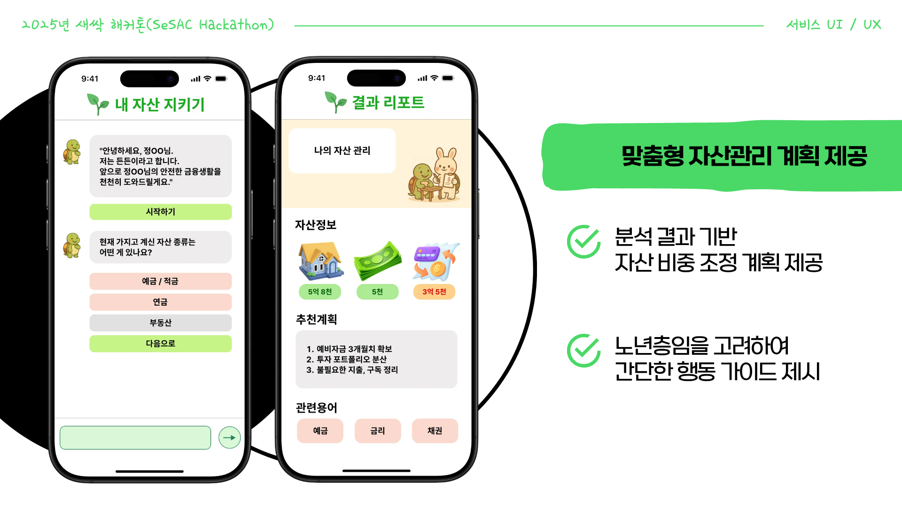
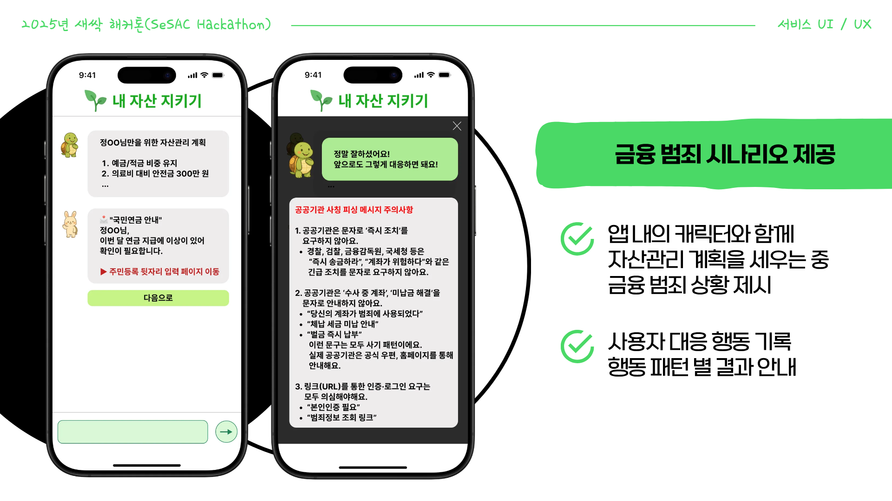
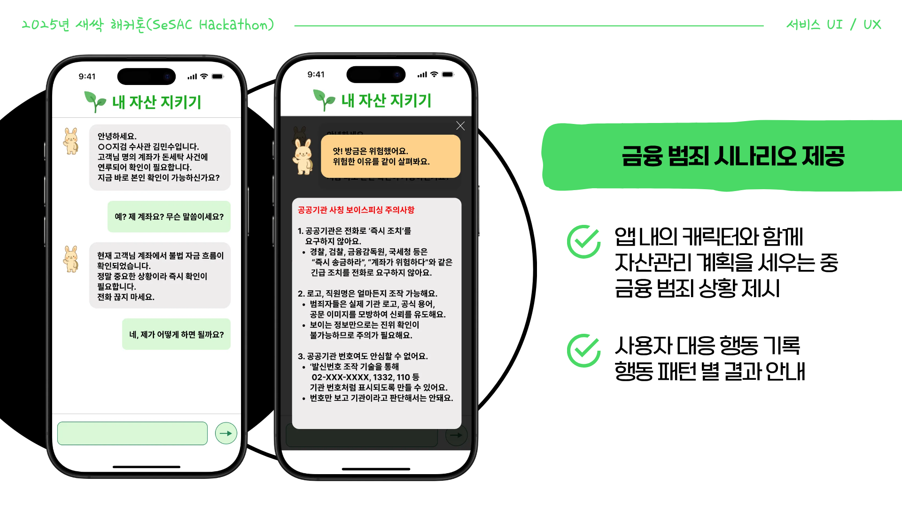
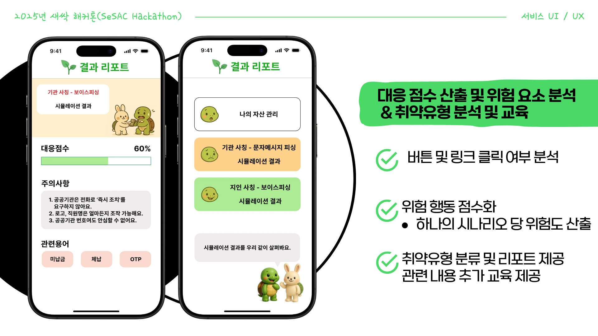

### 🧮 대응 점수 산출 및 위험 요소 분석 방법

| 사용자 행동 | 설명 | 위험도 | 점수 |
|-------------|-------|---------|--------|
| 주민등록번호/계좌 입력 시도 | 고위험 개인정보 제공 시도 | 매우 높음 | +40 |
| “지금 전화하기” 버튼 누름 | 사칭 전화 연결 위험 | 높음 | +25 |
| 링크 클릭 + 정보 입력 안함 | 초기 대응 실패 | 중간 | +15 |
| 의심스러운 메시지 종료 | 적절한 행동 | 매우 낮음 | 0 |
| “공식 사이트 확인” 선택 | 최적 행동 | 매우 낮음 | -10 |

이를 기반으로 시나리오별 대응 점수 분석하여 취약 유형 분류 및 리포트 제공

 

## ✔️ 기대효과
#### 🚩 노년층 대상 금융 범죄 피해 감소
#### 🚩 노년층의 금융이해도 및 자산관리 능력 향상
#### 🚩 노년층의 안전한 금융 생활을 위한 사회적 비용 감소
#### 🚩 공공기관, 금융기관 협력 기반 마련

 

## 🐢 팀 소개
<table>
 <tr>
    <td align="center"><a href="https://github.com/DoxB"></td>
    <td align="center"><a href="https://github.com/kimnagyeong99"></td>
  </tr>
  <tr>
    <td align="center"><a href="https://github.com/DoxB"><b>임정규</b></td>
    <td align="center"><a href="https://github.com/kimnagyeong99"><b>김나경</b></td>
  </tr>
  <tr>
    <td align="center">Front-End / Back-End</td>
    <td align="center">Front-End / Back-End</td>
  </tr>
</table>